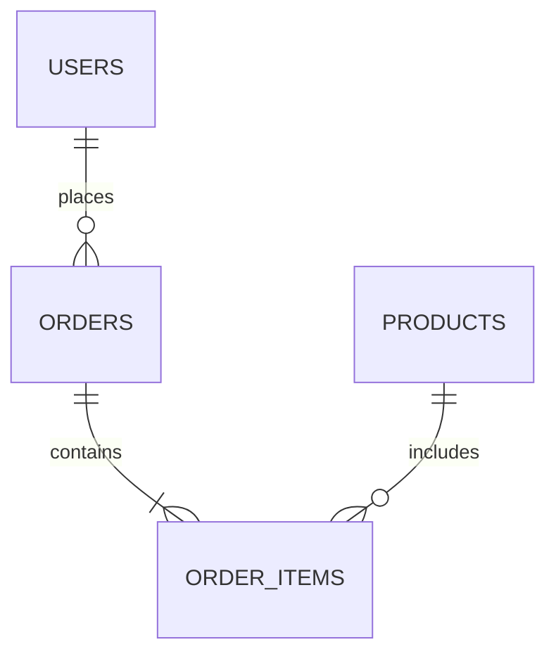

# Role Playbook: Database Administrator (DBA)

**Role:** Database Administrator
**Focus:** Schema analysis, query patterns, migration review, data health
**Time:** 30-45 minutes

---

## Purpose

Analyze a codebase from a DBA perspective to understand:
- Database schema design and relationships
- Query patterns and performance
- Migration strategy and history
- Data integrity and constraints

---

## Quick Prompt

```
Read @GenDD-Flow/playbooks/by-role/dba.md
Analyze @TargetRepo for database patterns and health.
```

---

## Full Analysis Prompt

```
Read @GenDD-Flow/playbooks/by-role/dba.md

Analyze @TargetRepo from a DBA perspective:

## Context
- Database: [PostgreSQL | MySQL | SQL Server | MongoDB | Other]
- ORM: [EF Core | GORM | Prisma | Sequelize | None]
- Size: [Approximate row counts for key tables]
- Critical Tables: [Tables with business-critical data]

## Phase 1: Schema Analysis

### Table Inventory
| Table | Purpose | Est. Rows | Key Fields | Relationships |
|-------|---------|-----------|------------|---------------|
| [users] | User accounts | [n] | id, email | → roles, → profiles |

### Relationship Map
```
[users] 1──┬──N [orders]
            │
            └──1 [profiles]

[orders] N──┬──N [products]
             │
             └──1 [addresses]
```

### Schema Health
| Check | Status | Issues |
|-------|--------|--------|
| Primary keys | All tables | None/[issues] |
| Foreign keys | [coverage] | [missing relations] |
| Indexes | [assessment] | [missing indexes] |
| Constraints | [assessment] | [missing constraints] |
| Naming conventions | Consistent/Inconsistent | [issues] |

## Phase 2: Migration Analysis

### Migration History
| Migration Tool | Location | Count | Last Migration |
|----------------|----------|-------|----------------|
| [EF/Flyway/etc] | [path] | [n] | [date] |

### Migration Quality
| Check | Status | Issues |
|-------|--------|--------|
| Reversibility | All/Some/None reversible | [issues] |
| Data migrations | [assessment] | [issues] |
| Zero-downtime compatible | Yes/No | [issues] |
| Tested in staging | Yes/No | [issues] |

### Pending/Risky Migrations
| Migration | Risk | Issue | Recommendation |
|-----------|------|-------|----------------|
| [migration] | High/Med/Low | [issue] | [action] |

## Phase 3: Query Pattern Analysis

### Query Locations
| Location | Pattern | Example |
|----------|---------|---------|
| Repository layer | ORM queries | `UserRepository.FindById()` |
| Raw SQL | Inline/Files | `queries/*.sql` |
| Stored procedures | [count] | [examples] |
| Views | [count] | [examples] |

### Query Anti-Patterns
| Pattern | Occurrences | Impact | Location |
|---------|-------------|--------|----------|
| N+1 queries | [n] | High | [files] |
| SELECT * | [n] | Medium | [files] |
| No pagination | [n] | High | [files] |
| Missing indexes hint | [n] | Medium | [files] |
| Cartesian joins | [n] | High | [files] |

### Complex Queries
| Query/Location | Complexity | Tables Joined | Estimated Impact |
|----------------|------------|---------------|------------------|
| [query] | High | [n] | [assessment] |

## Phase 4: Index Analysis

### Existing Indexes
| Table | Index | Columns | Type | Usage |
|-------|-------|---------|------|-------|
| [table] | idx_[name] | [columns] | [B-tree/Hash] | [assessment] |

### Recommended Indexes
| Table | Columns | Reason | Priority |
|-------|---------|--------|----------|
| [table] | [columns] | [query pattern] | High/Med/Low |

### Potentially Unused Indexes
| Table | Index | Reason |
|-------|-------|--------|
| [table] | [index] | No queries use these columns |

## Phase 5: Data Integrity

### Constraints
| Type | Coverage | Missing |
|------|----------|---------|
| NOT NULL | [assessment] | [columns] |
| UNIQUE | [assessment] | [columns] |
| CHECK | [assessment] | [columns] |
| Foreign Key | [assessment] | [relations] |

### Data Validation
| Validation | Database | Application | Gap |
|------------|----------|-------------|-----|
| Email format | No | Yes | DB validation missing |
| Enum values | [status] | [status] | [gap] |
| Range checks | [status] | [status] | [gap] |

## Phase 6: Performance Considerations

### Large Tables
| Table | Est. Size | Partitioning | Archiving |
|-------|-----------|--------------|-----------|
| [table] | [rows/GB] | Yes/No/Needed | [strategy] |

### Connection Management
| Aspect | Implementation | Status |
|--------|----------------|--------|
| Connection pooling | [Yes/No] | Good/Missing |
| Pool size | [size] | Appropriate/Adjust |
| Timeout handling | [approach] | Good/Missing |

### Caching
| Cache Layer | Implementation | Tables Cached |
|-------------|----------------|---------------|
| Query cache | [approach] | [tables] |
| Application cache | [approach] | [entities] |

## Phase 7: Backup & Recovery

### Current State
| Aspect | Status | Notes |
|--------|--------|-------|
| Backup strategy | [approach] | [frequency] |
| Point-in-time recovery | Yes/No | [window] |
| Tested restoration | Yes/No | [last test] |

## Phase 8: Recommendations

### Critical (P1)
| Issue | Risk | Recommendation | Effort |
|-------|------|----------------|--------|
| [Issue] | Data loss/Performance | [Action] | [days] |

### Important (P2)
| Issue | Risk | Recommendation | Effort |
|-------|------|----------------|--------|

### Optimization (P3)
| Issue | Risk | Recommendation | Effort |
|-------|------|----------------|--------|
```

---

## Output: DBA Assessment Report

```markdown
# Database Assessment: [Project Name]
Generated: [Date]
Analyzed by: DBA Playbook

## Database Overview

- **Engine:** [PostgreSQL/etc]
- **ORM:** [Tool]
- **Schema Version:** [Migration #]
- **Tables:** [Count]

## Schema Summary

### Entity Relationship


### Table Health
| Table | Rows | Indexes | FKs | Health |
|-------|------|---------|-----|--------|

## Query Analysis

### Anti-Patterns Found
| Pattern | Count | Impact | Files |
|---------|-------|--------|-------|

### Missing Indexes
| Table | Columns | Expected Benefit |
|-------|---------|------------------|

## Migration Review

### Status
- Total migrations: [n]
- Reversible: [%]
- Last migration: [date]

### Risks
1. [Risk]

## Data Integrity

### Constraint Coverage
| Type | Coverage |
|------|----------|

### Missing Constraints
| Table | Column | Constraint |
|-------|--------|------------|

## Recommendations

### Immediate
- [ ] [Action]

### Short-term
- [ ] [Action]

### Long-term
- [ ] [Action]
```

---

## Follow-Up Actions

For playbook selection guidance, see `playbooks/PLAYBOOK-GUIDE.md`.
