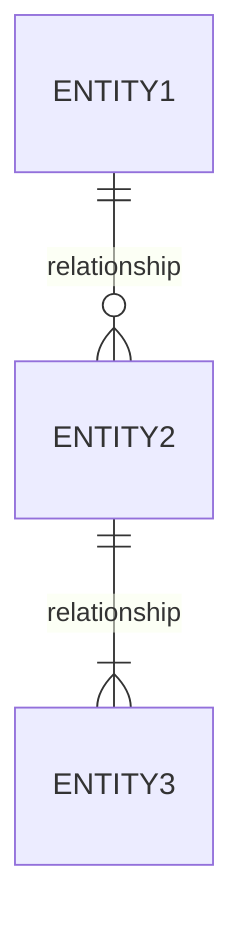

# Role Playbook: Business Analyst

**Role:** Business Analyst
**Focus:** Requirements elicitation, process flows, gap analysis, domain modeling, story crafting
**Time:** 45-60 minutes

---

## Purpose

Analyze a codebase from a Business Analyst perspective to understand:
- Business processes implemented in code
- Domain model and entity relationships
- Requirements traceability
- Process improvement opportunities
- Story quality and acceptance criteria completeness

---

## {ORGANIZATION} Story Crafting Standards

> **Reference:** This playbook aligns with {ORGANIZATION}'s **Story Templates** and **Definition of Ready** standards.

### User Story Template

Business Analysts are responsible for translating business needs into delivery-ready stories:

**Story Sections:**

| Section | Purpose | Required |
|---------|---------|----------|
| **User Story Statement** | As a [user/role], I want [capability], So that [business value] | Yes |
| **Context & References** | Figma links, API/DB/integration references, Related Epic | Yes |
| **Current Source of Truth** | If no formal documentation exists, state where truth lives (code path, stored procedure, SME) | Yes |
| **Acceptance Criteria** | Must use dedicated AC field with Gherkin format | Yes |
| **Integration & Risk Flags** | External integration? Security review required? | Yes |
| **Environment & Test Data** | Requires specific environment? Specific test data or configuration? | When applicable |
| **Testing & Automation Notes** | Planned automated coverage, or reason if none planned | Recommended |
| **Release Notes** | User-visible behavior change summary | Optional |

### Acceptance Criteria Format (Gherkin)

All ACs must be written in the dedicated Acceptance Criteria field using Gherkin format:

```gherkin
Given [context]
When [action]
Then [expected outcome]
```

**Required AC coverage:**
- Happy path scenarios
- At least one negative or edge case
- Integration behavior expectations

### Anti-Patterns to Avoid

| Anti-Pattern | Problem | Fix |
|--------------|---------|-----|
| ACs in Description or comments | Not visible, not tracked | Use dedicated AC field |
| "See STR" without expected behavior | QA discovers requirements via bugs | Define expected behavior explicitly |
| Implicit integration logic | Tribal knowledge dependency | Document integration impact |
| Implementation steps as ACs | Constrains engineering, not testable | Describe outcomes, not how |

---

## Quick Prompt

```
Read @GenDD-Flow/playbooks/by-role/business-analyst.md
Analyze @TargetRepo for requirements and process flows.
```

---

## Full Analysis Prompt

```
Read @GenDD-Flow/playbooks/by-role/business-analyst.md

Analyze @TargetRepo from a Business Analyst perspective:

## Context
- Product: [PRODUCT NAME]
- Business Domain: [DOMAIN]
- Key Stakeholders: [LIST]

## Phase 1: Domain Model Discovery

Analyze data models and entities:
1. Identify all domain entities
2. Map relationships between entities
3. Document business rules in code

Generate:
| Entity | Description | Relationships | Business Rules |
|--------|-------------|---------------|----------------|
| [Entity] | [Purpose] | [Related entities] | [Rules/constraints] |

## Phase 2: Process Flow Mapping

For each business process:
1. Trace the flow through the code
2. Document decision points
3. Identify actors and triggers

| Process | Trigger | Steps | Actors | Outcome |
|---------|---------|-------|--------|---------|
| [Process name] | [What starts it] | [Count] | [Who/what] | [Result] |

## Phase 3: Requirements Reverse Engineering

Extract implicit requirements from code:
| Requirement | Evidence | Type | Status |
|-------------|----------|------|--------|
| [Inferred requirement] | `[file:function]` | Functional/NFR | Implemented |

### Translate to Story Format

For each inferred requirement, draft a story-ready format:

```
As a [user identified from code]
I want [capability identified]
So that [business value inferred]

**Acceptance Criteria:**
Given [context from code]
When [action from code]
Then [expected outcome from code]

**Integration Impact:** [External systems identified]
**Security Review:** [PCI/PII/Auth flags from code]
```

## Phase 4: Gap Analysis

Compare implementation against standard patterns:
| Expected Capability | Current State | Gap | Impact |
|---------------------|---------------|-----|--------|
| [Capability] | Full/Partial/None | [What's missing] | High/Med/Low |

## Phase 5: Data Dictionary

Document key business terms:
| Term | Definition | Code Reference | Usage Context |
|------|------------|----------------|---------------|
| [Business term] | [Meaning] | `[Entity/Field]` | [Where used] |

## Phase 6: Integration Points

Map external system interactions (critical for Story Template Integration & Risk Flags):

| Integration | Purpose | Data Flow | Business Rules | Story Impact |
|-------------|---------|-----------|----------------|--------------|
| [System] | [Why] | In/Out/Both | [Validation, transforms] | Flag for DoR |

### Integration Documentation for Stories

For each integration point, document:
- External systems involved (Skyward, Qmlativ, Powerschool, payment providers, etc.)
- Integration status: Yes / No / Unknown
- Test data dependencies or environment requirements

## Phase 7: Story Readiness Review

Assess existing backlog items against Definition of Ready:

| Story | Problem Clear | AC Format | Scope Defined | Integration ID'd | Gaps |
|-------|---------------|-----------|---------------|------------------|------|
| [Story] | Yes/No | Gherkin/Prose/None | Yes/No | Yes/No | [List] |

### Common Story Quality Issues

| Issue | Frequency | Impact | Recommended Fix |
|-------|-----------|--------|-----------------|
| ACs not in dedicated field | [%] | QA discovers requirements via bugs | Move to AC field |
| Missing edge cases | [%] | Late discovery, rework | Add negative scenarios |
| No integration flags | [%] | Surprise dependencies | Add Integration Impact section |
| "See STR" patterns | [%] | Expected behavior undefined | Document expected behavior |

## Phase 8: Recommendations

| Area | Finding | Recommendation | Priority |
|------|---------|----------------|----------|
| [Area] | [Issue/Opportunity] | [Action] | P1/P2/P3 |
```

---

## Output: Business Analysis Report

```markdown
# Business Analysis: [Product Name]
Generated: [Date]
Analyzed by: Business Analyst Playbook

## Domain Overview
[Description of the business domain and key concepts]

## Domain Model



## Business Processes

### Process 1: [Name]
**Trigger:** [What starts it]
**Actors:** [Who participates]
**Flow:**
1. [Step] → See `[file:function]`
2. [Step] → See `[file:function]`
**Business Rules:**
- [Rule 1]
- [Rule 2]
**Outcome:** [Result]

## Data Dictionary
[Table of business terms]

## Requirements Traceability
[Inferred requirements mapped to code]

## Gap Analysis Summary
[Key gaps identified]

## Recommendations
[Prioritized recommendations]
```

---

## BPMN Process Diagram Template

```
Read @GenDD-Flow/playbooks/by-role/business-analyst.md

Generate BPMN-style process diagram for @TargetRepo:

Process: [PROCESS NAME]

Output as Mermaid flowchart showing:
- Start/End events
- Activities (tasks)
- Gateways (decisions)
- Actors (swim lanes if complex)
- Data objects
```

---

## Follow-Up Actions

For playbook selection guidance, see `playbooks/PLAYBOOK-GUIDE.md`.
