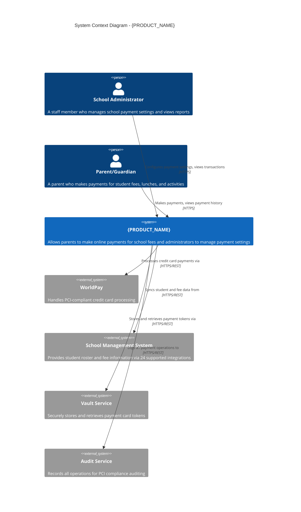
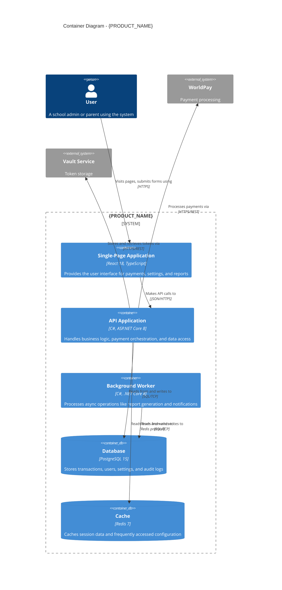
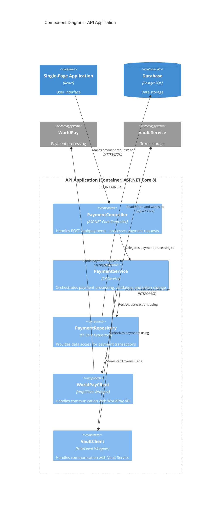
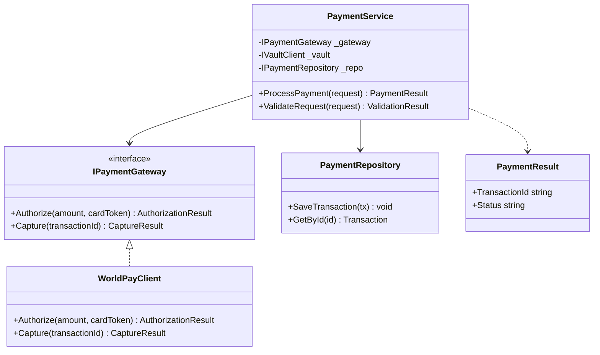
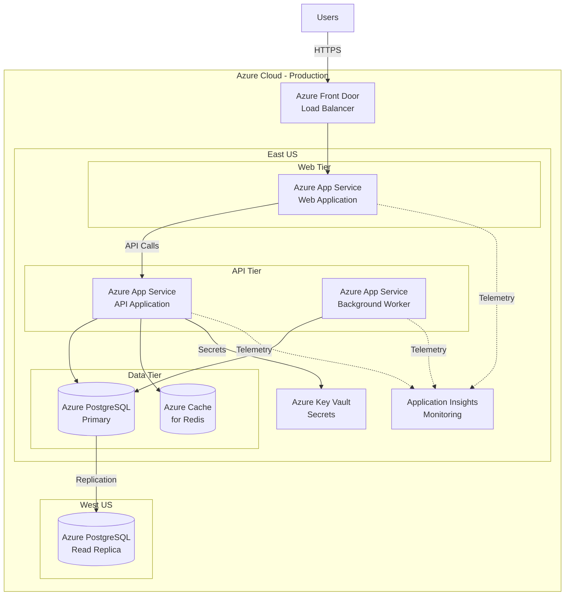

# Workflow: Generate Architecture Diagrams

| Field | Value |
|-------|-------|
| **Category** | on-demand |
| **Target Roles** | Architect, Tech Lead |
| **Prerequisites** | Repository access, understanding of C4 model levels, optionally brownfield analysis complete |
| **Inputs** | Path to the target repository, project name, tech stack, key integrations, deployment environment |
| **Outputs** | Mermaid C4 diagrams: Context (L1), Container (L2), Component (L3), optional Code (L4) for core components, Deployment |

## Quick Start

**Copy-paste this to generate all 4 C4 diagrams:**

```
Read @GenDD-Flow/workflows/generate-architecture-diagrams.md

Analyze @TargetRepo and generate C4 architecture diagrams:

Project: [PROJECT NAME]
Tech Stack: [TECHNOLOGIES]
Key Integrations: [EXTERNAL SYSTEMS]

Generate:
1. C4 Context Diagram (Level 1) - System and its environment
2. C4 Container Diagram (Level 2) - Applications and data stores  
3. C4 Component Diagram (Level 3) - Main container internals
4. C4 Code Diagram (Level 4) - For core/complex components only (see "When to use Level 4" below)
5. C4 Deployment Diagram - Infrastructure topology

Output as Mermaid diagrams.
Save to @TargetRepo/docs/architecture/
```

**Expected Output:**
```
@TargetRepo/docs/architecture/
├── context-diagram.mmd
├── container-diagram.mmd
├── component-diagram.mmd
├── code-diagram-<ComponentName>.mmd   (optional, for core components)
└── deployment-diagram.mmd
```

---

## Context
Auto-generate C4 model architecture diagrams from codebase. This is a priority for your VP of Architecture: standardizing architecture diagrams across {ORGANIZATION}. Currently, {ORGANIZATION} lacks standardized diagrams, causing onboarding difficulties and architectural drift.

## Prerequisites
- Access to codebase you want to diagram
- Cursor or similar AI IDE installed
- Understanding of C4 model levels (Context, Container, Component, Code)
- Lucidchart account (for final diagram storage)
- Confluence access (for documentation)

## C4 Model Quick Reference

Per the official C4 model, there are **4 core static structure diagrams** and **3 supporting diagrams**:

### Static Structure Diagrams (Core)

| Level | Name | Scope | Primary Elements | Supporting Elements |
|-------|------|-------|------------------|---------------------|
| 1 | **System Context** | System and environment | The software system | People and external systems |
| 2 | **Container** | Single software system | Containers (apps, DBs) | People and external systems |
| 3 | **Component** | Single container | Components | Other containers, external systems |
| 4 | **Code** | Single component | Classes, interfaces, key types, DB tables | (Optional; use for core/complex components only) |

**Why Level 4 (Code) is often excluded:** Per the C4 Code diagram guidance, Level 4 is "very much an optional level of detail." It is usually omitted because: (1) it goes stale quickly as code changes, (2) IDEs can generate class/type views on demand, and (3) it adds maintenance overhead. The C4 site recommends it only for "the most important or complex components."

**When to include Level 4:** Include a Code diagram when a component is **core** (e.g. payment orchestration, tenant resolution, auth) or **complex** (many types, non-obvious structure). Use it to tell a clear story (e.g. key interfaces, main types, critical tables)—not to document every class. Keep one diagram per such component and regenerate when that component’s design changes.

### Supporting Diagrams

| Type | Purpose | Use Case |
|------|---------|----------|
| **System Landscape** | Multiple systems in organization | Enterprise view |
| **Dynamic** | Runtime behavior | Sequence/collaboration |
| **Deployment** | Infrastructure mapping | DevOps, operations |

> **C4 Model Guidance:** "You don't need to use all 4 levels of diagram; only those that add value - the system context and container diagrams are sufficient for most software development teams."

### {ORGANIZATION} Standard
- Focus on Levels 1–3 + Deployment; add **Level 4 (Code) for core or complex components** when it adds value
- Use Mermaid format (renders in GitHub, Confluence, VS Code)
- Store final versions in Lucidchart and Confluence
- Include scope/purpose statements per C4 notation

### Required Elements Per Diagram

| Diagram | Must Include |
|---------|--------------|
| Context | Scope, system, users, external systems, relationships with descriptions |
| Container | Scope, System_Boundary, all containers with technology, external systems |
| Component | Scope, Container_Boundary, components with technology, dependencies |
| Code (optional) | Scope: one component; key classes/interfaces/types or DB tables; only attributes/methods that tell the story |
| Deployment | Deployment_Nodes, container instances, infrastructure technology |

## When to Use This Workflow
- Starting a new project (document target architecture)
- Working with legacy code (document current state)
- Preparing for ARB (Architecture Review Board)
- Onboarding new developers
- Preparing ADR (Architecture Decision Record)
- Documenting migration (before and after states)
- **After Brownfield Analysis** - Use architecture hypotheses from `workflows/brownfield-repository-analysis.md` as foundation

## Before You Start

- [ ] Repository is cloned and accessible
- [ ] You know the project name, tech stack, and key integrations
- [ ] You understand the C4 model levels (Context, Container, Component, Code)
- [ ] Optionally and recommended: brownfield analysis is complete for more accurate diagrams

## Cursor Steps

### Phase 1: Context Diagram (C4 Level 1)

#### 1. Open Cursor in Repository Root

Navigate to the repository you want to diagram.

#### 2. Generate Context Diagram

Open Cursor Chat (Cmd+L / Ctrl+L) and paste:

```
Analyze this codebase and generate a C4 Context diagram.

Project: {PROJECT_NAME} (e.g., {PRODUCT_NAME})

**NFR Constraints (if available from requirements):**
| NFR | Target | Architecture Impact |
|-----|--------|---------------------|
| Performance | {e.g., <200ms p95} | {e.g., Need caching layer} |
| Availability | {e.g., 99.9%} | {e.g., Multi-region} |
| Security | {e.g., PCI Level 1} | {e.g., Tokenization service} |
| Scalability | {e.g., 10K concurrent} | {e.g., Horizontal scaling} |

Follow C4 model conventions:

**Scope:** The {PROJECT_NAME} system and its environment

**Primary elements:** The {PROJECT_NAME} software system

**Supporting elements:** People (users) and external software systems

Generate a Context diagram showing:
1. The system (this codebase) as the central element
2. All external actors (users, administrators) with descriptions
3. All external systems this integrates with and their purpose
4. Relationships with verb-phrase descriptions (e.g., "Makes payments using")

Output as Mermaid C4Context diagram syntax.

Include:
- User personas with role descriptions (e.g., "A school administrator who manages payments")
- External systems with purpose (e.g., "Handles PCI-compliant payment processing")
- Relationship descriptions using verb phrases
- Protocol information on technical relationships
- External systems driven by NFRs (e.g., CDN for performance, Vault for security)
```

#### 3. Review and Refine

AI will generate a Mermaid diagram. Review it against C4 standards:



#### C4 Context Checklist
- [ ] Title includes "System Context Diagram"
- [ ] System description explains *what it does* for users
- [ ] Person descriptions explain *who they are* and *what they do*
- [ ] External systems explain their *purpose*
- [ ] Relationships use verb phrases (not just nouns)
- [ ] Protocols specified on technical relationships

If anything is missing, refine:

```
Add these additional external systems to the Context diagram:
- Email Service (SendGrid) - for receipts and notifications
- Reporting Service - for analytics
- SSO Providers (SAML/OAuth) - for authentication

Update the Mermaid diagram.
```

### Phase 2: Container Diagram (C4 Level 2)

#### 4. Generate Container Diagram

```
Now generate a C4 Container diagram for the same system.

Follow C4 model conventions:

**Scope:** The {PROJECT_NAME} software system

**Primary elements:** Containers (applications and data stores) within the system

**Supporting elements:** People and external software systems directly connected

**NFR-Driven Containers (include if NFRs require):**
- Performance NFR → Cache container (Redis), CDN, Message Queue
- Security NFR → Vault/Secrets container, API Gateway
- Availability NFR → Load Balancer, Health Check service
- Scalability NFR → Worker containers, Queue processors

Show:
1. System_Boundary() around all containers belonging to this system
2. Frontend application(s) with technology (e.g., "React 18, TypeScript")
3. Backend API(s) with framework (e.g., "C#, ASP.NET Core 8")
4. Database(s) with type (e.g., "PostgreSQL 15")
5. Background services/workers
6. How containers communicate with verb-phrase descriptions
7. Containers added to satisfy NFRs (note which NFR in description)

Output as Mermaid C4Container diagram syntax.

For each container, use format:
Container(id, "Name", "Technology", "Description of responsibility [NFR: X if applicable]")
```

#### 5. Review Container Diagram



#### C4 Container Checklist
- [ ] Title includes "Container Diagram"
- [ ] System_Boundary() wraps all containers in the system
- [ ] Each container has: Name, Technology, Description
- [ ] ContainerDb() used for databases
- [ ] External systems shown outside the boundary
- [ ] Relationships use verb phrases with protocols

If more detail needed:

```
Break down the API Application container into its key modules:
- Payment Processing Module
- User Management Module
- Integration Module (third-party APIs)
- Configuration Module
- Reporting Module

Show how these modules interact.
```

### Phase 3: Component Diagram (C4 Level 3)

#### 6. Generate Component Diagram (for key containers)

For complex containers, generate a Component diagram:

```
Generate a C4 Component diagram for the "API Application" container.

Follow C4 model conventions:

**Scope:** The API Application container

**Primary elements:** Components within the API Application

**Supporting elements:** Other containers and external systems directly connected

Show:
1. Container_Boundary() around all components in this container
2. Controllers (API endpoints) with technology
3. Services (business logic) with responsibility
4. Repositories (data access) with ORM
5. Integration clients (external APIs) with protocol
6. Dependencies between components with verb-phrase descriptions

Output as Mermaid C4Component diagram syntax.

Important: Only diagram ONE container's internals. Other containers appear outside the boundary.
```

#### 7. Review Component Diagram



#### C4 Component Checklist
- [ ] Title includes "Component Diagram" and container name
- [ ] Container_Boundary() includes container name and technology
- [ ] Only ONE container's internals shown
- [ ] Each component has: Name, Technology, Description
- [ ] Other containers shown outside the boundary
- [ ] Relationships describe what interaction does (verb phrases)

### Phase 3b: Code Diagram (C4 Level 4) – for core components only

Include this phase only for **core** or **complex** components (e.g. payment orchestration, tenant resolution, auth, or components with many types and non-obvious structure).

#### When to generate a Code diagram

- The component is **core** to the system (payments, auth, tenant resolution, etc.)
- The component is **complex** (many types, non-obvious relationships)
- Onboarding or design reviews would benefit from a code-level view
- You are documenting a critical refactor or migration of that component

#### 7b. Generate Code diagram (for one component)

Pick one component from the Component diagram (e.g. `PaymentService`, `TenantResolver`) and run:

```
Generate a C4 Level 4 (Code) diagram for the component "{COMPONENT_NAME}".

Follow C4 model conventions:

**Scope:** The {COMPONENT_NAME} component only

**Primary elements:** Key code elements—classes, interfaces, main types, or database tables—that tell the story of how this component works

**Intended audience:** Software architects and developers

Show only what tells the story:
1. Main interfaces and their responsibilities
2. Key classes and their relationships (inheritance, composition)
3. Critical methods or operations (e.g. ProcessPayment, ResolveTenant)
4. If data-heavy: main entities or DB tables and relationships

Do NOT show every class or every method—only those that explain the component's design.

Output as:
- Mermaid classDiagram for OO code (classes, interfaces), or
- Mermaid erDiagram for DB-centric components

Name the file: code-diagram-{ComponentName}.mmd (e.g. code-diagram-PaymentService.mmd)
```

#### 7c. Review Code diagram

Example (Mermaid class diagram for a payment service):



#### C4 Code checklist

- [ ] Scope is **one component** (one boundary from the Component diagram)
- [ ] Only **key** types/interfaces/classes shown—enough to tell the story, not the whole codebase
- [ ] Title includes "Code Diagram" and component name
- [ ] Relationships are clear (implements, uses, returns)
- [ ] File named `code-diagram-<ComponentName>.mmd` and stored under `docs/architecture/`

If the component is DB-centric (e.g. schema for a core domain), use an ER-style diagram instead:

```mermaid
erDiagram
    title Code Diagram - Payment Domain (PaymentService persistence)

    TRANSACTION ||--o{ PAYMENT_EVENT : has
    TRANSACTION {
        uuid id PK
        string tenant_id
        decimal amount
        string status
        timestamp created_at
    }
    PAYMENT_EVENT {
        uuid id PK
        uuid transaction_id FK
        string event_type
        string payload
    }
```

#### When to skip Level 4

- Component is simple or standard (e.g. CRUD controller with one service)
- IDE or existing tooling already provides an adequate code view
- Team does not need long-lived code-level docs for this component

### Phase 4: Deployment Diagram (Azure/AWS)

#### 8. Generate Deployment Diagram

```
Generate a C4 Deployment diagram showing how this system is deployed.

Follow C4 model conventions:

**Scope:** The {PROJECT_NAME} system deployment to {ENVIRONMENT}

**Primary elements:** Deployment nodes (infrastructure) and container instances

Environment: {Azure | AWS | On-Premises | Hybrid}

Show:
1. Deployment_Node() for infrastructure (App Services, VMs, Kubernetes)
2. Nested Deployment_Node() for runtime environments
3. Container() instances deployed within nodes
4. Networking (VNets, Load Balancers as nodes)
5. Security (Key Vaults as nodes)
6. Relationships showing network communication with protocols

Output as Mermaid C4Deployment diagram syntax.

For {ORGANIZATION} specifically:
- Azure App Services for web and API
- Azure PostgreSQL Database
- Azure Key Vault for secrets
- Azure Application Insights for monitoring
- Multi-region deployment if applicable
```

#### 9. Review Deployment Diagram



### Phase 5: Export and Store Diagrams

#### 10. Convert to Lucidchart Format

{ORGANIZATION} standard is Lucidchart for formal storage. Options:

**Option A: Manual Recreation**
1. Copy Mermaid diagram as reference
2. Recreate in Lucidchart using C4 shapes
3. Follow {ORGANIZATION}'s diagram style guide

**Option B: Use Mermaid in Lucidchart**
1. Lucidchart supports Mermaid import (limited)
2. Create diagram, use Mermaid as starting point
3. Enhance with Lucidchart styling

**Option C: Keep as Mermaid in Confluence**
1. Confluence supports Mermaid diagrams natively
2. Embed Mermaid code blocks
3. Renders automatically

#### 11. Store Diagrams

Save to standard {ORGANIZATION} locations:

**In Repository** (recommended):
```
/docs/architecture/
  ├── context-diagram.mmd (Mermaid source)
  ├── context-diagram.png (rendered image)
  ├── container-diagram.mmd
  ├── container-diagram.png
  ├── component-diagram.mmd
  ├── component-diagram.png
  ├── code-diagram-<ComponentName>.mmd   (optional; for core components only)
  ├── code-diagram-<ComponentName>.png
  ├── deployment-diagram.mmd
  └── deployment-diagram.png
```

**In Confluence**:
- Page: `{Product} Architecture`
- Section: `Architecture Diagrams`
- Link to Lucidchart (if stored there)
- Embed Mermaid (if preferred)

**In Lucidchart**:
- Folder: `{ORGANIZATION} Architecture / {Product}`
- Naming: `{Product} - C4 Context`, etc.

**As LikeC4 (Architecture-as-Code)**:

For version-controlled, AI-friendly architecture diagrams, generate LikeC4 format:

```
/docs/architecture/
  ├── model.c4                # Complete architecture model
  └── likec4.config.json      # Optional configuration
```

LikeC4 prompt template:
```
Generate a LikeC4 architecture model for {PROJECT_NAME}:

specification {
  // Element kinds use nested style blocks
  element actor {
    style {
      shape person
      color primary
    }
  }
  element system {
    style {
      shape rectangle
      color amber
    }
  }
  element container {
    style {
      shape rectangle
      color green
    }
  }
  element component {
    style {
      shape rectangle
      color indigo
    }
  }
  element database {
    style {
      shape storage
      color green
    }
  }
  element external {
    style {
      shape rectangle
      color muted
    }
  }

  // Relationship kinds use DIRECT properties (NOT nested style block)
  relationship sync {
    line solid
    color blue
  }
  relationship async {
    line dashed
    color amber
  }
  relationship dataflow {
    line dotted
    color sky
  }
}

model {
  // Define actors, systems, containers, components
  // Use relationships with verb phrases
  User = actor 'User' {
    description 'End user'
  }

  MySystem = system 'My System' {
    description 'The system being documented'

    Api = container 'API' {
      description 'Backend API service'
    }
  }

  User -[sync]-> MySystem.Api 'Makes requests to'
}

views {
  view context of MySystem {
    title 'System Context'
    include *
    autoLayout TopBottom
  }
}

```

Output as a .c4 file following LikeC4 conventions.

**IMPORTANT LikeC4 Syntax Rules:**

| Construct | Syntax | Example |
|-----------|--------|---------|
| **Element style** | Nested `style {}` block | `element actor { style { shape person } }` |
| **Relationship style** | Direct properties (NO `style {}`) | `relationship sync { line solid; color blue }` |
| **Colors** | Use built-in names | `primary`, `secondary`, `muted`, `amber`, `blue`, `green`, `indigo`, `red`, `sky`, `gray` |
| **Line styles** | `line` property | `solid`, `dashed`, `dotted` |
| **Reserved keywords** | Cannot use as element names | `deploymentNode`, `deployment`, `specification`, `model`, `views` |

**Common Pitfalls:**
- ❌ `relationship sync { style { line solid } }` - relationships don't use nested style blocks
- ✅ `relationship sync { line solid; color blue }` - direct properties at relationship level
- ❌ `element deploymentNode { ... }` - `deploymentNode` is reserved, use `infraNode` instead
- ✅ Use `deploymentNode` keyword only in `specification {}` for deployment model kinds

#### LikeC4 Benefits

| Feature | Benefit |
|---------|---------|
| **Architecture-as-Code** | Diagrams live in Git, track changes with diffs |
| **Instant Feedback** | VS Code extension shows live preview |
| **AI-Friendly** | MCP server exposes architecture to AI agents |
| **Interactive Embeds** | React/Web components for docs and apps |

#### 12. Update ADR (if applicable)

If generating diagrams for an ADR:

```
Create markdown for an Architecture Decision Record (ADR) that includes these diagrams.

ADR Title: {DECISION_TITLE}

Include:
- Context section with Context diagram
- Decision section with Container diagram
- Implementation section with Component diagram
- Deployment section with Deployment diagram

Format for inclusion in ADR documentation.
```

### Phase 6: Validate and Review

#### 13. Validate with Team

Before finalizing:
- [ ] Share with Tech Lead for accuracy review
- [ ] Verify all external integrations shown
- [ ] Confirm technology versions correct
- [ ] Check security/compliance elements present
- [ ] Validate data flow directions

#### 14. Compare: Current vs. Target State

For migration projects, generate both:

```
Generate two sets of C4 diagrams:

1. "Current State" - how the system works today
2. "Target State" - how it will work after migration

Highlight differences:
- Technology changes (e.g., Python 2 → Python 3)
- Architecture changes (e.g., monolith → microservices)
- New components added
- Components being removed

Output both as Mermaid diagrams with clear labeling.
```

## Example: {PRODUCT_NAME} Architecture

### Input to Cursor:
```
Analyze the {PRODUCT_NAME} codebase and generate all C4 diagrams (Context, Container, Component, Deployment).

Project: {PRODUCT_NAME} - {ORGANIZATION}'s payment processing engine for faith-based organizations

Tech Stack:
- Python 2.7 (migrating to Python 3.12)
- Django 1.11
- PostgreSQL
- On-premises deployment (2 data centers)
- Integrates with WorldPay, First Data, Vault Service

Current architecture is legacy (20 years old), planning migration to Azure.
```

### Output:

**Context Diagram** (shows system and external entities)
**Container Diagram** (shows Python apps, database, worker processes)
**Component Diagram** (shows Django apps, custom ORM, business logic)
**Deployment Diagram - Current** (shows on-premises data centers)
**Deployment Diagram - Target** (shows Azure App Services)

All formatted as Mermaid, ready to render and store.

## Advanced: Generate Sequence Diagrams

For complex interactions:

```
Generate a sequence diagram showing the payment processing flow.

Actors:
- User
- Web Application
- API Application
- Payment Service
- WorldPay
- Vault Service
- Database

Show the complete flow from user clicking "Pay" to payment confirmation.

Output as Mermaid sequence diagram.
```

## Automation: Keep Diagrams Up-to-Date

### Option 1: Git Hook
Create a git hook that reminds to update diagrams:

```bash
# .git/hooks/pre-commit
echo "Have you updated architecture diagrams if architecture changed?"
```

### Option 2: CI/CD Integration
Generate diagrams automatically in CI:

```yaml
# .github/workflows/update-diagrams.yml
name: Update Architecture Diagrams
on:
  push:
    branches: [main]
jobs:
  diagrams:
    runs-on: ubuntu-latest
    steps:
      - uses: actions/checkout@v3
      - name: Generate diagrams
        run: |
          # Use mermaid-cli to render diagrams
          mmdc -i docs/architecture/context-diagram.mmd -o docs/architecture/context-diagram.png
```

### Option 3: Documentation Review Cycle
Quarterly review:
1. Tech Lead reviews all architecture diagrams
2. Updates diagrams if drift detected
3. Re-runs this workflow to regenerate

## Success Metrics
- **Coverage**: 100% of products have C4 diagrams
- **Accuracy**: Diagrams reflect actual deployed architecture
- **Freshness**: Diagrams updated within 1 sprint of architecture changes
- **Usefulness**: New developers reference diagrams during onboarding

## Tips for Best Results

### Provide Codebase Context
Better results if you provide:
- List of key files/directories
- Technology versions
- Known integrations
- Deployment environment

### Iterate on Complexity
Start simple, add detail:
1. First pass: High-level Context
2. Second pass: Add more external systems
3. Third pass: Break down into containers
4. Fourth pass: Detail key components (Component diagrams)
5. Optional: Add Code diagrams (Level 4) only for core or complex components

### Use Existing Diagrams as Reference
If partial diagrams exist:

```
Here's an existing (outdated) architecture diagram:
{PASTE_DIAGRAM_OR_DESCRIPTION}

Update this to reflect current codebase.
Compare the code to the diagram and identify:
1. What's changed
2. What's missing
3. What's obsolete

Generate updated C4 diagrams.
```

### Validate with Architecture Review Board
For formal diagrams:
1. Generate draft with this workflow
2. Review with ARB
3. Incorporate feedback
4. Finalize and store

## Common Pitfalls to Avoid

### C4 Model Violations
- ❌ **Missing scope statements**: Every diagram needs Scope, Primary elements, Supporting elements
- ❌ **Noun-only relationships**: Use verb phrases ("Makes API calls to" not "API calls")
- ❌ **Missing technology labels**: Containers and components need technology info
- ❌ **Nested boundaries wrong**: Container diagrams use System_Boundary, Component diagrams use Container_Boundary
- ❌ **Multiple containers in Component diagram**: Only show ONE container's internals
- ❌ **Level 4 everywhere**: Code diagrams are for core/complex components only; avoid documenting every component at code level (they go stale quickly)

### General Pitfalls
- ❌ **Too much detail**: Keep C4 Context and Container high-level
- ❌ **Stale diagrams**: Update when architecture changes
- ❌ **Missing security**: Include Key Vaults, encryption, auth flows
- ❌ **Ignoring deployment**: Deployment diagrams are critical
- ❌ **Not validating**: AI might miss integrations, always review with team

### C4 Model Best Practices
- ✅ Start with Context and Container - they're "sufficient for most teams"
- ✅ Each diagram should tell a story to its audience
- ✅ Use consistent naming across all diagram levels
- ✅ Relationship descriptions should be unambiguous
- ✅ Technology choices should be specific (version numbers when relevant)
- ✅ Use Level 4 (Code) only for core or complex components; keep it minimal and refresh when that component’s design changes

## What's Next

- [ ] [Create Context Pack](create-context-pack.md) to include architecture.md referencing these diagrams
- [ ] [Run Delta Analysis](../playbooks/on-demand/run-delta-analysis.md) after architecture changes to keep diagrams current
- [ ] [Update Documentation](../playbooks/recurring/update-documentation.md) when architecture evolves
- [ ] Present diagrams to ARB if preparing for architectural review

## Integration with Other Workflows

### Inputs From Other Workflows

**From Brownfield Repository Analysis** (`workflows/brownfield-repository-analysis.md`):
- **Architecture hypotheses** (Pass 2) → Use as foundation for diagrams
- **Service catalog** → Map to C4 containers
- **Data ownership** → Show in component diagrams
- **Core flows** → Sequence diagrams

```
# Using brownfield analysis to generate architecture diagrams
Read @GenDD-Flow/workflows/generate-architecture-diagrams.md

Use the brownfield analysis from @docs/brownfield/:
- Architecture hypotheses → confirmed architecture pattern
- Service catalog → C4 containers
- Core flows → sequence diagrams
- Data ownership → component boundaries

Generate C4 diagrams:
1. Context Diagram (from architecture hypotheses)
2. Container Diagram (from service catalog)
3. Component Diagram (from core flows)
```

### Follow-Up Workflows
After generating diagrams:
1. Use `templates/architecture-decision-record.md` to document decisions
2. Use `workflows/accelerate-onboarding.md` to create onboarding docs with diagrams
3. Use `workflows/assess-technical-debt.md` to identify architectural issues
4. Present to ARB if preparing for architectural review
5. Update Confluence and Lucidchart with final diagrams

---

## References

### GenDD-Flow Related
- [Brownfield Analysis](brownfield-repository-analysis.md) - Use as input for diagrams
- [Architect Playbook](../playbooks/by-role/architect.md) - Role-specific architecture analysis
